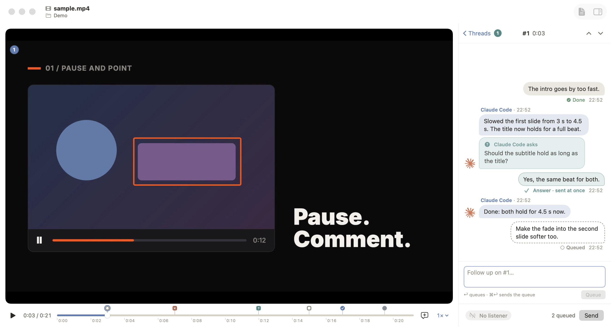

<p align="center"></p>

# Havooch

A native macOS video player for giving feedback to coding agents: pause a video, point at its frame, comment, and your agent does the work and answers beside the video.



## The agent loop

1. Open a screen recording, a demo or any video of the thing you're building.
2. Pause anywhere and write a comment, or drag a region on the frame first to point at something. Comments on one frame form a thread.
3. Comments queue up. **Cmd+Enter** sends the whole queue as one batch to the agent session that listens, with each comment's timestamp, the keyframe, the region and the transcript around that moment.
4. The agent acknowledges, works through each thread in your repository, and answers on the thread, inside the player. When it can't tell what you mean, it asks you there, and you answer in place.

The player shows whether an agent is listening, and each comment's state: queued, sent, acknowledged, working, done or failed.

## Install

Havooch needs macOS 26 (Tahoe) or later on an Apple silicon Mac.

**Homebrew:**

```sh
brew install --cask yahyabedirhan/tap/havooch
```

**Install script:**

```sh
curl -fsSL https://raw.githubusercontent.com/yahyabedirhan/havooch/main/scripts/install.sh | bash
```

The script downloads the latest release, checks its SHA-256, installs `Havooch.app` in `/Applications`, links the `havooch` command into `/usr/local/bin` (or `~/.local/bin` when that isn't writable) and installs the `havooch-mate` skill with `npx skills add` when `npx` is there. Options: `--app-dir <dir>`, `--bin-dir <dir>`, `--no-skill`. To remove the app and the command's link:

```sh
curl -fsSL https://raw.githubusercontent.com/yahyabedirhan/havooch/main/scripts/install.sh | bash -s -- --uninstall
```

## First launch

Havooch is ad-hoc signed and not notarized by Apple, so macOS may refuse to open it the first time, saying it can't check the app for malicious software. Allow it once:

1. Open **System Settings › Privacy & Security**.
2. Next to the message about Havooch, click **Open Anyway**, then confirm.

Or clear the quarantine flag from a terminal:

```sh
xattr -dr com.apple.quarantine /Applications/Havooch.app
```

## The command and the mate skill

The app carries a command, `havooch`, in `Havooch.app/Contents/Helpers/`; both installs link it onto your `PATH`. An agent drives the app through it:

- `havooch wait`, `ack`, `status`, `reply` and `ask` are the listener's commands: take a send, acknowledge it, report progress, answer on a thread, ask a question.
- `havooch app open --demo <folder>`, the player and comment commands and `havooch screenshot` drive the app, under a lease the agent takes with `havooch control take` and gives back with `control release`, so it never fights you for the player.
- `havooch --help` lists every command.

The **havooch-mate** skill teaches a coding agent the listener's loop. Install it on its own with:

```sh
npx skills add yahyabedirhan/havooch --skill havooch-mate --global
```

Then ask your agent, for example Claude Code, to listen for Havooch feedback.

## Build from source

You need macOS 26 and Swift 6.2 or later (Xcode 26, or the Command Line Tools). There is no Xcode project; everything goes through the `Makefile`:

```sh
make           # build the app and the command (release)
make test      # run the tests
make bundle    # build/Havooch.app, ad-hoc signed
make install   # bundle, then replace /Applications/Havooch.app and open it
```

A `v<version>` tag that matches `Sources/ReviewWire/Version.swift` makes a GitHub Release with the zipped app and its SHA-256 (`.github/workflows/release.yml`).

## Licence

MIT. See [LICENSE](LICENSE).
