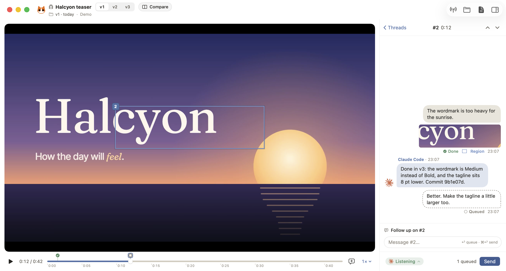
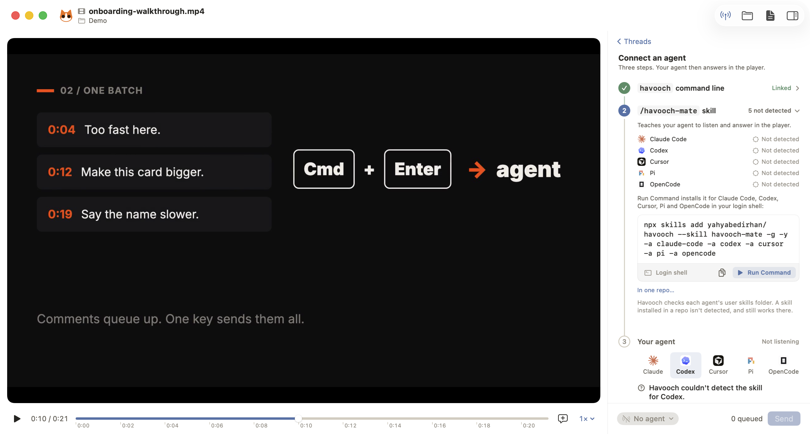
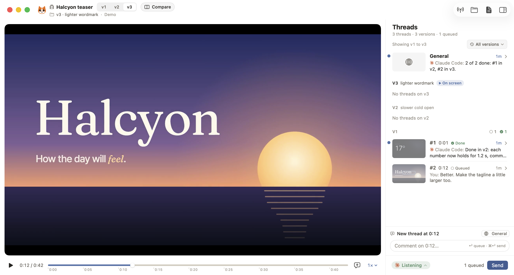

<p align="center"></p>

<h1 align="center">Havooch</h1>



## What is Havooch

Havooch is a video player for your Mac that lets you give feedback to a coding agent the way you'd give it to a person.

When your agent builds something you can watch, like an app, an animation or a video, it's often easier to show what's wrong than to describe it. With Havooch you pause the video, point at the spot, and say what you want changed. Your agent gets each comment with the moment and the frame it's about, does the work, and answers you right beside the video.

## How it works

1. **Open a video** of the thing you're building: a screen recording, a demo, a render.
2. **Pause and comment.** Point at something on the frame if it helps. Comments on the same moment form a thread.
3. **Send** your comments to your agent when you're ready.
4. **Your agent does the work** in your repository and answers on each thread, inside the player. When something isn't clear, it asks you there.

## Install

Havooch needs an Apple silicon Mac with macOS 26 (Tahoe) or later.

```sh
brew install --cask yahyabedirhan/tap/havooch
```

Or, without Homebrew:

```sh
curl -fsSL https://raw.githubusercontent.com/yahyabedirhan/havooch/main/scripts/install.sh | bash
```

**The first time you open it,** macOS may say "Havooch Not Opened", because the app isn't notarized by Apple yet. Open **System Settings › Privacy & Security** and click **Open Anyway** next to Havooch. You only do this once.

## Connect your agent

Havooch isn't an agent itself. It works with the one you already use: **Claude Code, Codex, Cursor, Pi or OpenCode**.

Open the **Connect** view from the header and follow its three steps:

1. **The `havooch` command:** link it, if your install didn't already.
2. **The `/havooch-mate` skill:** click **Run Command** to install it. It needs Node.js.
3. **Your agent:** pick it, and paste the prompt Havooch gives you into a session in your project, for example `/havooch-mate listen for my feedback on launch.mp4`.

Now send your comments, and your agent picks them up.



### What the command and the skill do

**The `havooch` command** is a small tool that ships inside the app. Your agent can't click around in Havooch, so the command is how it talks to the app: it picks up the comments you send and puts its answers on their threads.

**The [`/havooch-mate`](https://github.com/yahyabedirhan/havooch-mate) skill** teaches your agent how to use that command. With it, your agent knows to wait for your comments, work through each one, and answer or ask on its thread. Whatever you type in the agent's chat stays a normal conversation.

## Projects and versions

When you ask for a change to the video itself, your agent turns it into a **project**. Each new render opens as the next version, and your threads come along. Switch versions from the header, or open **Compare** to see two versions side by side, flip between them or drag a slider across.



## Learn more

The [guide](docs/guide.md) covers the rest: windows and the ways to open a video, the first-run window, the prompt for each agent, Compare, your settings in `config.toml`, every `havooch` command, the install options, and how to uninstall.

## Build from source

You need macOS 26 and Swift 6.2 or later. There's no Xcode project; everything goes through the `Makefile`:

```sh
make test      # run the tests
make install   # build, replace /Applications/Havooch.app and open it
```

## Licence

MIT. See [LICENSE](LICENSE).

If you use Havooch, or build on its code or its ideas, please cite it. GitHub's **Cite this repository** button gives you the reference, from [`CITATION.cff`](CITATION.cff).
