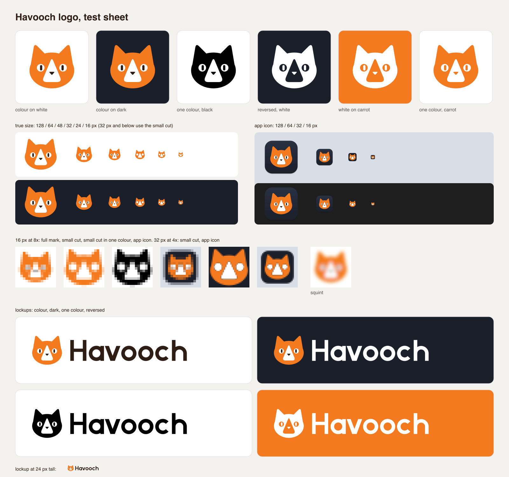

# Havooch logo

The head of Havuç, the maintainer's orange-and-white cat. "Havuç" is Turkish for "carrot"; "Havooch" spells how it sounds.



## Concept

A carrot-orange cat head made of one ellipse and two rounded ears. The white blaze down its face is a rounded triangle: the stripe an orange-and-white cat has, and a quiet play sign. The upright pupils are the only other detail. They drop out in the small cut.

Round 1 had three concepts, drawn in black (`concepts/havooch-concepts.png`):

- **A, Pause eyes**: slit eyes drawn as the two bars of the pause sign. Clever, but the face read as a robot, and in colour it lost the white of an orange-and-white cat.
- **B, Play blaze** (chosen): the white blaze is a play triangle. The two colours of the cat carry the idea, so colour, one colour and 16 px all keep it.
- **C, Comment cat**: the head as a speech bubble. Literal, and the tail made the head lopsided at small sizes.

## Colours

| Name | Hex | Use |
|---|---|---|
| Carrot | `#F37A1F` | the fur |
| White | `#FFFFFF` | the blaze and the eyes |
| Ink | `#2E1D14` | the nose, the pupils and the wordmark on light backgrounds |
| Night | `#1B1F2A` | the app icon tile and the dark test background |

The blaze and the eyes are painted white in the colour files, so the mark works on light and dark backgrounds as it is. The one-colour files cut them out as holes.

## Type

The wordmark "Havooch" is drawn as paths, not set in a font: a geometric sans with a 24-unit stem, 100-unit x-height and round letters with one unit of overshoot. No font licence applies. On dark backgrounds the wordmark is white.

## Files

| File | What it is |
|---|---|
| `havooch-mark.svg` | the mark in colour, for 48 px and up |
| `havooch-mark-small.svg` | the small cut for 16 to 32 px: no nose or pupils, larger eyes and blaze, cropped tight |
| `havooch-mark-black.svg`, `-white.svg`, `-carrot.svg` | one colour; white is for dark backgrounds |
| `havooch-mark-small-black.svg`, `-white.svg`, `-carrot.svg` | the small cut in one colour |
| `havooch-lockup.svg` | mark and wordmark, for light backgrounds |
| `havooch-lockup-dark.svg` | mark and white wordmark, for dark backgrounds |
| `havooch-lockup-black.svg`, `-white.svg` | the lockup in one colour |
| `havooch-app-icon.svg` | the macOS app icon: an 824-unit rounded square (radius 185.4) on the 1024 grid, with a drop shadow |
| `havooch-app-icon-small.svg` | the app icon for 16 and 32 px, with the small-cut cat drawn larger |
| `AppIcon.icns` | the app icon, 16 to 1024 px, built with `iconutil` |
| `png/` | PNG exports: the marks at 16 to 1024 px, the lockups 1200 px wide, the app icon at 1024 px |
| `havooch-test-sheet.png` | backgrounds, one colour, reversed, the size ladders, 16 px pixels and the lockups |
| `concepts/` | the round-1 concepts and their sheet |

## Rebuild

```sh
python3 assets/images/logo/build_logo.py   # the SVGs, from one set of geometry
python3 assets/images/logo/export.py       # png/, AppIcon.icns and the test sheet (needs rsvg-convert and iconutil)
```

NOTE: The name and the mark have not had a trademark search.
