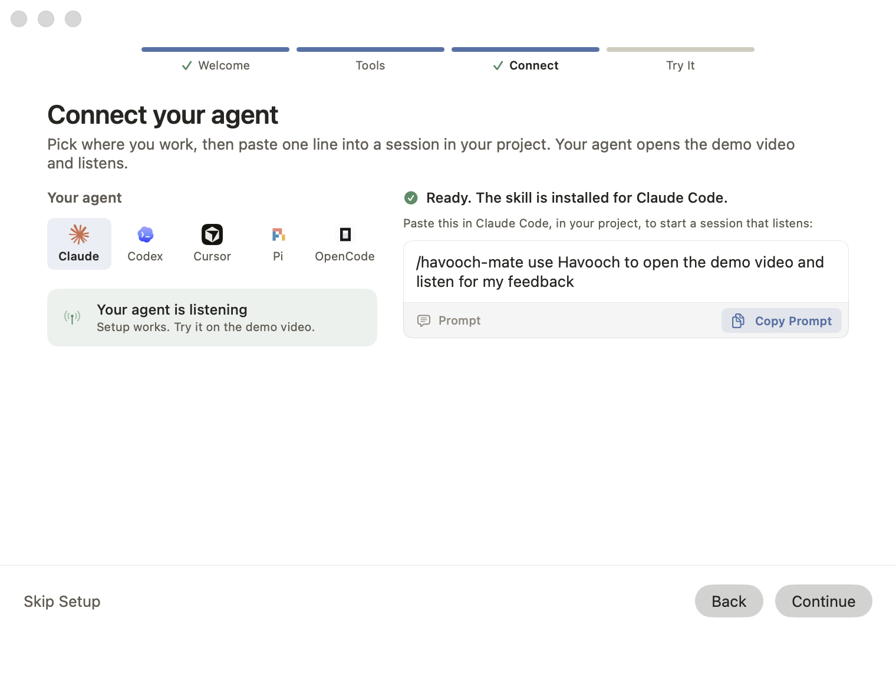
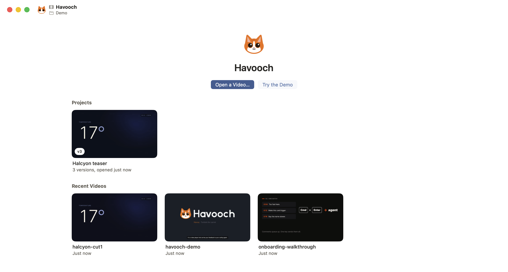
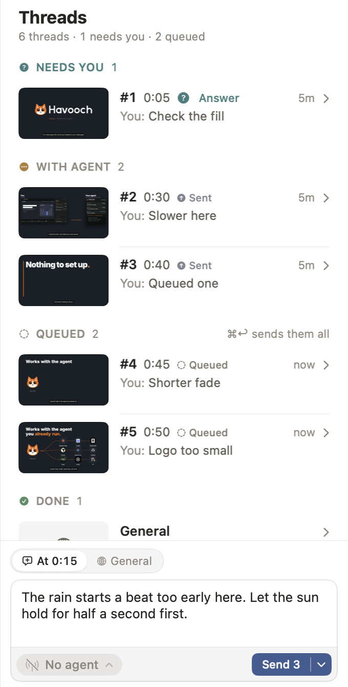
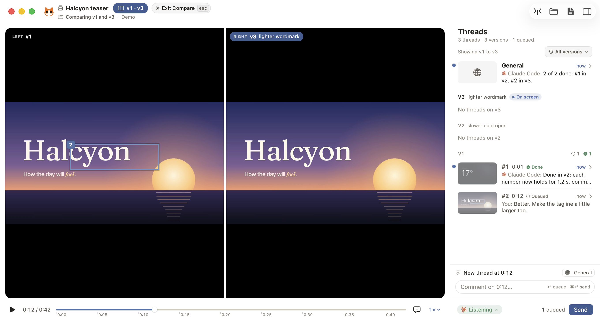

# Havooch guide

The details behind the [README](../README.md): how to install, open videos, connect an agent, work with projects, change your settings, use the `havooch` command, and uninstall.

## Install

Havooch needs macOS 26 (Tahoe) or later on an Apple silicon Mac.

### Homebrew

```sh
brew install --cask yahyabedirhan/tap/havooch
```

The cask installs `Havooch.app` and links the `havooch` command onto your `PATH`.

### Install script

```sh
curl -fsSL https://raw.githubusercontent.com/yahyabedirhan/havooch/main/scripts/install.sh | bash
```

The script:

1. Downloads the latest release and checks its SHA-256.
2. Puts `Havooch.app` in `/Applications`.
3. Links the `havooch` command into `/usr/local/bin`, or into `~/.local/bin` when it can't write there.

It leaves your agents' skills alone. Install the `havooch-mate` skill from Havooch's Connect view, for the agent you pick, or add `--with-skill`.

To pass an option, add `-s --` after `bash`:

```sh
curl -fsSL https://raw.githubusercontent.com/yahyabedirhan/havooch/main/scripts/install.sh | bash -s -- --with-skill
```

| Option | What it does |
|---|---|
| `--with-skill` | Also installs the `havooch-mate` skill for Claude Code, Codex, Cursor, Pi and OpenCode. It needs Node.js. With `--uninstall`, removes it too. |
| `--app-dir <folder>` | Puts the app in another folder. |
| `--bin-dir <folder>` | Links the command into another folder. |
| `--uninstall` | Removes the app and the command's link. |

### First launch

Havooch is ad hoc signed and not notarized by Apple. Homebrew quarantines the app it downloads, so macOS blocks Havooch the first time you open it or run `havooch`, since the command is a link into the app. macOS says "Havooch Not Opened" and that it can't check the app for malicious software. Allow it once:

1. Open **System Settings › Privacy & Security**.
2. Next to the message about Havooch, click **Open Anyway**, then confirm.

Or clear the quarantine flag from a terminal:

```sh
xattr -dr com.apple.quarantine /Applications/Havooch.app
```

The install script downloads with `curl`, which sets no quarantine flag, so macOS doesn't usually ask.

On the first launch Havooch shows a short first-run window: Welcome, Tools, Connect and Try It. You can skip any step. If you close the window without using it, it shows again at the next launch. It stops once you click **Get Started** or **Skip Setup**, open a video, or connect an agent. Until an agent connects, **Finish setup** in the header shows how many setup steps are left and opens a tour of the window.



## Windows, home and recent videos

Each window holds one video or one project. **File › New Window** (Cmd+N) opens an empty window on the home screen, which lists your projects and recent videos; click one to open it. A video that's already open brings its own window to the front instead of opening a second one.

You can open a video from anywhere:

- `havooch open <path>`, from a terminal or an agent. It starts the app when needed and brings the window to the front.
- **File › Open…** (Cmd+O), or **Open a Video…** on the home screen.
- Finder's **Open With › Havooch**, or a drop on Havooch in the Dock. Havooch never asks to be your default player.
- `open -a Havooch <path>`.

**Try the Demo** on the home screen opens a short video about Havooch itself.



## Comments, threads and sending

Pause anywhere and write a comment, or drag a region on the frame first to point at something. Comments on one frame form a thread. Comments queue up until you send them: **Send**, or **Cmd+Enter**, sends the whole queue as one batch to the agent that listens, with each comment's timestamp, the keyframe, the region and the transcript around that moment.

You can also write in the dock at the foot of the sidebar. In the thread list, the switch above it says where the words go: **At 0:15**, the playhead's frame and its thread, or **General**, the General thread about the whole video. A thread you opened shows its number there instead. A region you drew shows as a chip under the words. Return queues the words. **Send** sends the queue with them, and its menu holds **Queue** and **Send** too. When the agent asks you something, the button says **Answer**, and the answer goes at once. The pill beside it says whether an agent listens, and opens the **Connect** view.



A click on the video doesn't play or pause it: it only points. It also takes the keyboard from the message field, so Space plays and pauses and C starts a comment again. What you typed stays in the field.

A click on a thread's pin or badge opens the thread in a popover on the video. Drag any edge or corner of a popover to resize it, as you resize a window: the pointer shows the resize arrows there. A click without a drag changes nothing. Drag a thread's popover by its header to move it. Each thread keeps the place and the size you give its popover.

The agent acknowledges the batch, works through each thread in your repository, and answers on the thread, inside the player. When it can't tell what you mean, it asks you there, and you answer in place. The player shows whether an agent is listening, and each comment's state: queued, sent, acknowledged, working, done or failed.

## Connect an agent

Havooch works with the coding agent you already use, through the `havooch` command and the `/havooch-mate` skill. Each window has its own listener, so two agents can work on two videos at the same time.

The connect button in the header, the **No agent** pill, and **Send** with no agent listening all open the **Connect** view in the sidebar. It has three steps:

1. **`havooch` command line.** **Link** puts the command in `~/.local/bin`. Homebrew and the install script already link it.
2. **`/havooch-mate` skill.** **Run Command** installs the skill globally, for each agent that doesn't have it yet, with `npx skills add` in your login shell. It needs Node.js. **In one repo…** gives the command to install it in one repository instead.
3. **Your agent.** Pick your agent and copy its prompt into a session in your project.

Havooch shows a check mark only for what it can detect: it looks in each agent's user skills folder. A skill installed in a repository shows **Not detected** and still works.

The prompt names the window's video, or its project:

| Agent | Prompt |
|---|---|
| Claude Code | `/havooch-mate listen for my feedback on launch.mp4` |
| Codex | `$havooch-mate listen for my feedback on launch.mp4` |
| Cursor | `/havooch-mate listen for my feedback on launch.mp4` |
| Pi | `/skill:havooch-mate listen for my feedback on launch.mp4` |
| OpenCode | `Use the havooch-mate skill to listen for my feedback on launch.mp4` |

For a project, the prompt ends with `project <slug>`, for example `project launch-video`. When nobody listens, **Send** keeps your messages in the outbox and delivers them when an agent connects. Once an agent listens, the Connect view shows it, where it runs and since when, with **Disconnect** and the prompt to listen again later.

## The `/havooch-mate` skill

The skill is a short set of instructions your agent loads when you call it. The `havooch` command gives your agent the tools, and the skill teaches it how to use them. After the prompt, the agent repeats this loop:

1. Waits for your next send from that window.
2. Acknowledges it, so the player shows the agent has it.
3. Does what each comment asks, in your repository, and reports its progress.
4. Answers on each comment's thread, or asks you there when something isn't clear.

Only what you send from Havooch drives the loop. Whatever you type in the agent's chat stays a normal conversation.

Install it from the Connect view with **Run Command**, or yourself:

```sh
npx skills add yahyabedirhan/havooch-mate --skill havooch-mate --global
```

To update it, run the same command again.

## Projects, versions and Compare

When you ask your agent for a change to the video itself, it makes a **project**: the video you're reviewing becomes v1, and your threads move into the project with it. Each new render the agent makes opens as the next version, with a short label of what changed. A video that only gets questions stays a plain video.

- **Versions.** The header switches between versions: the last three as segments, older ones from a searchable picker. The playhead keeps its time, so you see the same moment in each version.
- **Threads.** Threads belong to the project, not to one version. Each thread is tagged with the version it was raised on, and the thread list groups threads by version, newest first. **All versions** finds older ones. You can follow up on any thread, on any version.
- **Compare.** **Compare** opens a small preview of two versions, the previous one and the one on screen. Click a side to pick its version, and choose **Side by side**, **Flip** or **Slider**. Both versions play on one playhead, and a message goes to the side you click or draw on. **Exit Compare** or Escape goes back to one version.



## Settings: config.toml

Your settings are one file, `~/.config/havooch/config.toml` (or `$XDG_CONFIG_HOME/havooch/config.toml` when that variable is set). You and your agent edit it, and Havooch applies each save at once. A save with a mistake keeps the last valid settings, and the window says what is wrong.

```toml
version = 1

# Leave it out to follow the Mac's light or dark appearance.
theme = "Tokyo Night"

[[projects]]
slug = "launch-video"
title = "Launch video"
versions = [
  { path = "~/Videos/launch-cut1.mp4" },
  { path = "~/Videos/launch-cut2.mp4", label = "slower intro" },
]
```

- `theme` pins a theme by name. `havooch theme list` prints the built-in themes and yours; your own themes are JSON files in `themes/` beside `config.toml`.
- `[[projects]]` holds each project and its versions, v1 first. `havooch project new` and `havooch project add` write it for you.
- `havooch config path` prints where the file is, and `havooch config check` says whether it reads, each problem with its line. The file's `#:schema` line names its JSON Schema.

Recent videos, playheads and your threads are app state, kept out of this file.

## The `havooch` command

The command ships inside the app, at `Havooch.app/Contents/Helpers/havooch`. Homebrew and the install script put it on your `PATH`, and **Link** in the Connect view does the same. Most commands talk to the Havooch app running on your Mac. An agent that listens uses only a few of them:

| Group | Commands | What they do |
|---|---|---|
| Open | `open` | Open a video, in its project when one lists it. |
| Listen | `wait`, `ack`, `status`, `reply`, `ask` | The listener's loop: take a send, acknowledge it, report progress, answer on a thread, ask a question. `wait --video <path>` or `wait --project <slug>` picks the window. |
| Projects | `project`, `version`, `compare` | Make a project and add versions, show a version, drive Compare. |
| Settings | `config`, `theme` | Find and check `config.toml`, list and pin themes. |
| Setup | `setup`, `connect`, `first-run`, `tour` | Link the command, install the skill, and drive the Connect view, the first-run window and the tour. |
| App control | `control`, `app`, `window`, `state`, `player`, `comment`, `thread`, `send`, `context`, `screenshot` | Drive the app for checks and screenshots. An agent takes a lease first with `control take` and gives it back with `control release`, so it never fights you for the player. `app open --demo <folder>` runs the app on a separate folder, not your data. |

`havooch --help` lists every command, and `havooch --version` prints the version.

## Uninstall

Pick the way that matches how you installed Havooch.

| You installed with | Remove the app and the command | Also remove your reviews |
|---|---|---|
| Homebrew | `brew uninstall --cask havooch` | `brew uninstall --cask --zap havooch` |
| The install script | `curl -fsSL https://raw.githubusercontent.com/yahyabedirhan/havooch/main/scripts/install.sh \| bash -s -- --uninstall` | Move `~/Library/Application Support/Havooch` to the Trash too |

### With Mole

[Mole](https://github.com/tw93/mole) removes an app and most of what it leaves behind. Preview first, then remove:

```sh
mo uninstall --dry-run    # pick Havooch: shows what it would remove
mo uninstall              # pick Havooch again
```

Mole removes the app, your reviews in `~/Library/Application Support/Havooch` and the preferences file. Three things stay, so remove them after it:

```sh
rm -f ~/.local/bin/havooch /usr/local/bin/havooch    # the command's link
mv ~/.config/havooch ~/.Trash/                       # your settings
cd ~ && npx skills remove havooch-mate --global --yes   # the skill, for every agent
```

Nothing is left when this prints only "No such file or directory" for each path:

```sh
ls ~/.local/bin/havooch /usr/local/bin/havooch ~/.config/havooch ~/.agents/skills/havooch-mate
```

### What lives where

| What | Where |
|---|---|
| The app | `/Applications/Havooch.app` |
| The command's link | `/opt/homebrew/bin/havooch` from Homebrew, or `/usr/local/bin/havooch` or `~/.local/bin/havooch` from the install script or **Link** |
| Your reviews | `~/Library/Application Support/Havooch` |
| Your settings | `~/.config/havooch`, which Homebrew and the install script leave in place |
| The skill | `~/.agents/skills/havooch-mate`, linked into each agent's own skills folder. Remove it from your home folder with `cd ~ && npx skills remove havooch-mate --global`. In a project folder, the command also deletes that project's own copy of the skill. |

## Build from source

You need macOS 26 and Swift 6.2 or later (Xcode 26, or the Command Line Tools). There is no Xcode project; everything goes through the `Makefile`:

```sh
make           # build the app and the command (release)
make test      # run the tests
make bundle    # build/Havooch.app, ad hoc signed
make install   # bundle, then replace /Applications/Havooch.app and open it
```

`make install INSTALLED=<path>/Havooch.app` installs the build somewhere else and leaves the copy in `/Applications` alone.
